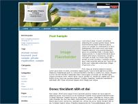

# Paperclip Theme for BlogEngine.NET 

This is a port of the Paperclip theme originally designed by [Telligent](https://telligent.com) included in their Community Server product.

- Cactus
- Fall
- Summer
- Winter

## Release History

Click on the [Releases](https://github.com/augustoproiete/Paperclip-BlogEngine-Theme/releases) tab on GitHub.

---

_Copyright &copy; 2008 C. Augusto Proiete & Contributors - Provided under the [Apache License, Version 2.0](http://apache.org/licenses/LICENSE-2.0.html)._
